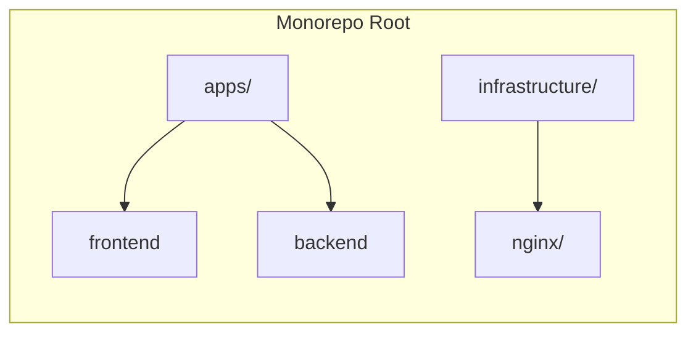
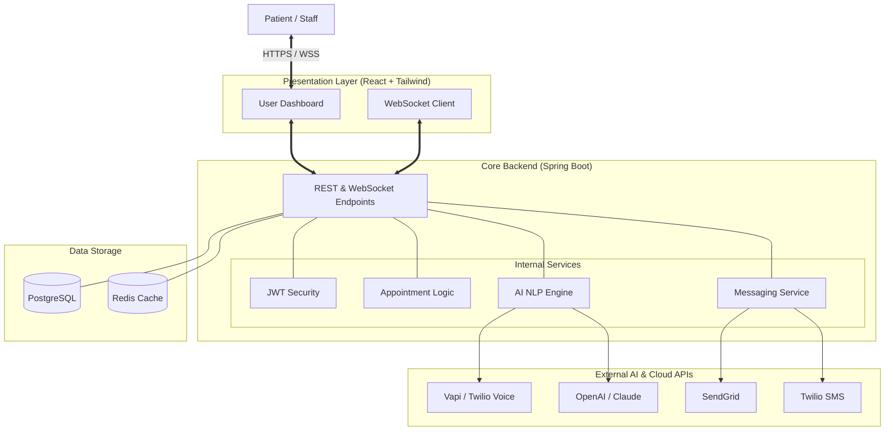
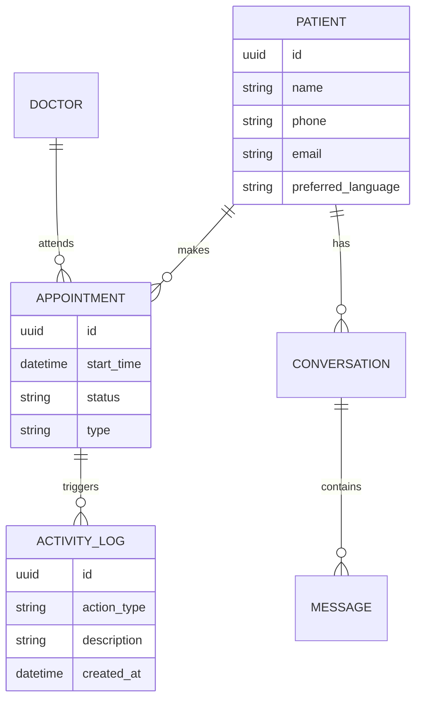

# 🏗️ SYSTEM_DESIGN.md - SmartReception

## 📌 Introduction
SmartReception is a state-of-the-art AI-driven hospital reception system. It integrates traditional hospital management with cutting-edge AI to automate patient interactions via Voice, SMS, and Email.

---

## 🏛️ High-Level Architecture

### Manual Monorepo Orchestration
The system follows a **Manual Monorepo** architecture designed for transparency and high maintainability. Instead of complex abstraction layers like Nx, it uses a standard directory structure with unified Docker-based orchestration for development and production.

### Workspace Structure
```text
Smart_Reception/
├── apps/
│   ├── frontend/       # React (Vite) + Tailwind CSS
│   └── backend/        # Spring Boot (Maven)
├── infrastructure/     # Docker, Nginx, DevOps configurations
├── .env                # Unified environment variables
└── docker-compose.yml  # Shared orchestration layer
```



---

## 🚀 Local Development Guide

To run the full SmartReception stack locally, follow these steps:

### 1. Prerequisites
- **Docker & Docker Compose** (Recommended)
- **Java 17+ & Maven** (For manual backend development)
- **Node.js 20+ & npm** (For manual frontend development)

### 2. Environment Setup
Create a `.env` file in the root directory (use `.env.example` as a template):
```bash
cp .env.example .env
```
Ensure all required variables like `JWT_SECRET`, `GOOGLE_CLIENT_ID`, etc., are correctly set.

### 3. Running with Docker (Recommended)
The easiest way to start the entire system (Database, Backend, Frontend, and Gateway):
```bash
# Build and start all services
docker compose up --build

# Start in detached mode
docker compose up -d
```
- **Gateway (Nginx):** [http://localhost:8000](http://localhost:8000)
- **Backend API:** [http://localhost:8080](http://localhost:8080)
- **Frontend App:** [http://localhost](http://localhost)

### 4. Running Manually (Standalone Dev)
If you prefer running services independently for faster iteration:

#### Backend:
```bash
cd apps/backend
mvn spring-boot:run
```

#### Frontend:
```bash
cd apps/frontend
npm install
npm run dev
```

#### Database:
You can start just the database using Docker:
```bash
docker compose up db -d
```

---



---

## 🛠️ Technology Stack

| Layer | Technology | Rationale |
| :--- | :--- | :--- |
| **Frontend** | React 18, Tailwind CSS, TanStack Query | Responsive, premium UI with efficient state management. |
| **Backend** | Java 17+, Spring Boot 3.x | Robust, scalable, and industry-standard for healthcare. |
| **Database** | PostgreSQL | Relational data integrity for appointments and logs. |
| **Real-time** | Spring WebSockets (STOMP) | Live activity feeds and instant staff notifications. |
| **AI / NLP** | OpenAI GPT-4o / LangChain4j | Advanced NLU and emotional intelligence. |
| **Voice/SMS** | Twilio / Vapi.ai | Reliable global communication infrastructure. |
| **Security** | Spring Security + JWT | Role-based access control (Doctor, Receptionist, Manager). |
| **DevOps** | Docker & Docker Compose | Consistent development and production environments. |

---

## 🧩 Key Modules

### 1. AI Orchestrator
This module handles the logic for voice and text-based AI.
- **Intent Recognition:** Parses "I want to see Dr. Smith tomorrow" into a structured booking request.
- **Sentiment Analysis:** Detects frustration or urgency to adapt the AI's tone.
- **STT/TTS Pipeline:** Manages the conversion between audio streams and text.

### 2. Communication Engine
A unified interface for all outbound/inbound patient contact.
- **Multi-channel:** Switches between SMS, Email, and Voice seamlessly.
- **Templating:** Uses Handlebars/Thymeleaf for dynamic, localized notification templates.

### 3. Real-time Notification Node
Uses WebSockets to push "Events" to the staff dashboards.
- **Event Bus:** Every database change (appointment created, call received) emits an event.
- **Priority Queue:** Critical events (e.g., patient emergency mentioned in AI call) get priority.

---

## 🗄️ Database Schema (Conceptual)



---

## 🔒 Security & Compliance
- **HIPAA Compliance Readiness:** Data encryption at rest (AES-256) and in transit (TLS 1.3).
- **Audit Logs:** Every interaction and system change is logged with a timestamp and user ID.
- **RBAC:** Strict access controls ensuring Doctors only see relevant patient history.

---

## 🚀 Scalability Plan
- **Horizontal Scaling:** Spring Boot instances behind an Nginx Load Balancer.
- **Async Processing:** Using Spring `@Async` or RabbitMQ for heavy tasks like sending bulk emails or processing long AI transcripts.
- **Caching:** Redis for frequently accessed doctor schedules to reduce DB load.
